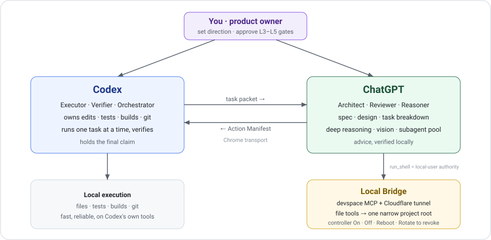

<h1 align="center">Claude Code ChatGPT Bridge</h1>

<p align="center">
  <strong>A safe bridge that lets Claude Code and ChatGPT hand off coding work — ChatGPT does the heavy thinking, Claude Code keeps local execution and verification under control.</strong>
</p>

<p align="center">
  <strong>Save Claude Code tokens</strong> ·
  <strong>ChatGPT plans, Claude Code executes</strong> ·
  <strong>Local execution stays scoped and re-keyable</strong>
</p>

<p align="center">
  <a href="https://github.com/Zhenyu98/claude-chatgpt-bridge/stargazers"></a>
  <a href="LICENSE"></a>
  
  
</p>

<p align="center">
  <a href="#what-this-is">What This Is</a> ·
  <a href="#why">Why</a> ·
  <a href="#quick-start">Quick Start</a> ·
  <a href="#agent-setup">Agent Setup</a> ·
  <a href="#reboot-without-relinking">Reboot Without Relinking</a> ·
  <a href="chatgpt-app-setup.md">App Setup</a> ·
  <a href="#routing-modes">Routing</a> ·
  <a href="#security-model">Security</a> ·
  <a href="#faq">FAQ</a> ·
  <a href="README_zh.md">简体中文</a>
</p>

<p align="center">
  
</p>

## What This Is

The MCP bridge itself is [DevSpace](https://github.com/Waishnav/devspace) — an upstream open-source project you install from npm as `@waishnav/devspace`. It owns the MCP server, OAuth, the file tools, and `run_shell`. This repository does not fork it, patch it, or wrap it in a second server.

This repository adds the two things missing when you put DevSpace between a coding agent and ChatGPT: **a skill that tells the agent how to use it**, and **control scripts that live outside the bridge process**.

| Layer | Owner | Responsibility |
|---|---|---|
| MCP bridge | DevSpace (upstream) | MCP server, OAuth, file tools, `run_shell` |
| Skill | this repo — `SKILL.md` | when to hand a task to ChatGPT, permission levels `L0`–`L5`, task-packet and manifest formats, approval gates |
| Control layer | this repo — `scripts/bridge_controller.ps1` | desired-state `On` / `Off` / `Reboot`, each a mutex-protected, health-verified transaction |
| External recovery | this repo — `scripts/restart_task.ps1` | an on-demand Windows scheduled task that can reboot a bridge the agent can no longer reach |
| Link stability | this repo — `scripts/set_cf_api_config.ps1` | refreshes the stable Worker upstream so the public MCP URL never moves |

Repo paths above are relative to [](skills/claude-chatgpt-bridge), which is what `install.ps1` copies to `%USERPROFILE%\.claude\skills\claude-chatgpt-bridge`.

The control layer is deliberately external. A bridge cannot restart itself once it is down, and an agent that has just stopped its own transport has no way back in — so the lifecycle lives in scripts the agent invokes, plus a scheduled task that Windows invokes when the agent cannot.

## Why

Two separate costs make a long agent session expensive. One is quota: planning, re-reading, and repeated design iterations burn Claude Code tokens, so this skill routes that work to ChatGPT and keeps Claude Code on execution and verification. The other is setup churn: a bridge that changes its public URL on every restart makes you re-edit the app URL and re-authorize, which is why people leave it running when they should be closing it.

| Before | After |
|---|---|
| Copy large context into the Claude Code chat to get a review | ChatGPT reads the scoped project directly over the bridge |
| Claude Code spends quota planning, re-reading, and iterating | ChatGPT plans and reviews; Claude Code executes one task at a time |
| Every restart rotates the tunnel URL, so you re-edit the ChatGPT app URL and re-authorize | The stable public URL stays pinned; `Reboot` refreshes the upstream behind it and the app link survives |
| The agent stops the bridge and has no way to bring it back | `Reboot` is one verified transaction, and an external scheduled task can run it from outside the process |
| `Off` is indistinguishable from a crash, so recovery tooling fights you | `Off` records an intentional shutdown, and `Reboot` refuses to override it |
| A remote tool with unclear reach into your machine | A narrow, OAuth-gated root that is off by default and re-keyable |

## Quick Start

```powershell
git clone https://github.com/Zhenyu98/claude-chatgpt-bridge.git
cd claude-chatgpt-bridge
powershell -ExecutionPolicy Bypass -File .\install.ps1
```

If a copy is already installed, the installer moves it to a timestamped backup before copying the new skill. Use `-ForceOverwrite` only when you want to discard that installed copy. Add `-RegisterRestartTask` only if you also want the optional, on-demand Reboot task.

Expected success signal:

```text
Installed claude-chatgpt-bridge skill to C:\Users\<you>\.claude\skills\claude-chatgpt-bridge
Restart Claude Code or reload skills to use it.
```

Then check the local environment (no tunnel started):

```powershell
$skill = "$env:USERPROFILE\.claude\skills\claude-chatgpt-bridge"
powershell -ExecutionPolicy Bypass -File "$skill\scripts\local_bridge.ps1" -Action Doctor
```

`Doctor` also reports whether the upstream bridge CLI is present. Install it from npm if it is missing — this repository drives that CLI rather than shipping its own:

```powershell
npm install -g @waishnav/devspace
```

## Agent Setup

Copy this prompt into Claude Code, Claude Code, Cursor, or another coding agent:

```text
Read https://github.com/Zhenyu98/claude-chatgpt-bridge/blob/main/agent-setup.md and follow it to install and configure claude-chatgpt-bridge for me.
```

See [agent-setup.md](agent-setup.md) for the full copy-paste prompt, prerequisites, and safe defaults.

## Routing Modes

- `NORMAL`: ChatGPT acts like a strong review/reasoning subagent. Claude Code inspects enough context to steer the task, then executes and verifies.
- `TOKEN_SAVING`: Claude Code acts mostly as the orchestrator. Safe non-mutating reading, broad review, and synthesis go to ChatGPT whenever they save Claude Code tokens.
- `CHATGPT_ARCHITECT`: the planning-inverted mode for long, continuous builds. ChatGPT is the architect/manager (spec, design, task decomposition, per-task prompts, review); Claude Code executes one small task at a time and verifies. With your explicit `L3` grant, ChatGPT can also write over the bridge while Claude Code integrates.

The router picks by marginal cost: a unit of work goes to ChatGPT when it saves far more Claude Code tokens than the cost of one slow bridge round-trip. When a plan needs parallel subagents, ChatGPT can serve as the subagent pool so the fan-out stays off Claude Code quota, while Claude Code remains the single orchestrator that integrates and verifies.

## Bridge Controller

```powershell
$skill = "$env:USERPROFILE\.claude\skills\claude-chatgpt-bridge"
$controller = "$skill\scripts\bridge_controller.ps1"

# Save a non-secret profile once. Use cloudflare for a changing Quick Tunnel,
# or cloudflare-worker plus a stable Worker URL.
powershell -ExecutionPolicy Bypass -File $controller -Action Configure -ProjectRoot "D:\your\project" -Tunnel cloudflare -InstallCloudflared

powershell -ExecutionPolicy Bypass -File $controller -Action On
powershell -ExecutionPolicy Bypass -File $controller -Action Reboot
powershell -ExecutionPolicy Bypass -File $controller -Action Off
powershell -ExecutionPolicy Bypass -File $controller -Action Status
powershell -ExecutionPolicy Bypass -File $controller -Action Doctor

# Panic button: revoke issued OAuth tokens and mint a new Owner password.
powershell -ExecutionPolicy Bypass -File "$skill\scripts\local_bridge.ps1" -Action Rotate
```

The controller is the external control layer and the primary entry point for all normal lifecycle operations. It keeps a non-secret desired-state profile separate from transient runtime state, so the difference between "off on purpose" and "died" is recorded rather than guessed. `On` records an intentional running state. `Off` records an intentional stopped state and closes the service and tunnel while preserving the ChatGPT app configuration. `Restart` and `Reboot` are the same mutex-protected transaction: stop, start, refresh Worker KV when configured, and verify the local, Quick Tunnel, and stable Worker endpoints before success. A Reboot refuses to reopen a bridge intentionally turned off with `Off`; use `On` to open it again.

DevSpace's own `Start` and `Stop` remain available as recovery primitives, but they do not own the desired-state contract and should not be an agent's default. Drive the lifecycle through `On`, `Off`, and `Reboot`.

For a stable Worker setup, configure the profile and store a minimum-scope Cloudflare token with Windows DPAPI **before** the first `On`:

```powershell
powershell -ExecutionPolicy Bypass -File $controller -Action Configure -ProjectRoot "D:\your\project" -Tunnel cloudflare-worker -PublicBaseUrl https://bridge.example.workers.dev -InstallCloudflared
powershell -ExecutionPolicy Bypass -File "$skill\scripts\set_cf_api_config.ps1" -Action Set -AccountId <account-id> -KvNamespaceId <namespace-id>
powershell -ExecutionPolicy Bypass -File $controller -Action On
```

To keep one default working directory while authorizing several explicit file roots, add a semicolon-separated list. `ProjectRoot` must be inside one of the allowed roots:

```powershell
powershell -ExecutionPolicy Bypass -File $controller -Action Configure -ProjectRoot "C:\Users\you\DevSpace" -AllowedRoots "C:\Users\you\DevSpace;D:\Projects;E:\Reference" -Tunnel cloudflare-worker -PublicBaseUrl https://bridge.example.workers.dev
```

The controller stores the list in profile schema v2 and forwards it to DevSpace on every `On` or `Restart`, so later configuration runs do not collapse access back to one root.

The credential helper reads the saved Worker URL from the controller profile and writes the matching non-credential operational metadata to `worker-proxy.json` alongside the DPAPI-protected credential. The file still contains your Worker URL and KV namespace ID: keep it local and out of git. You can override the URL explicitly with `-WorkerBaseUrl` for a standalone setup.

The helper verifies a DPAPI encrypt/decrypt round trip before saving and removes an older plaintext `cf-api.json` after a successful migration. Controller-driven `On` / `Reboot` rejects plaintext legacy credentials. If `-InstallCloudflared` downloads the tunnel binary, the bridge verifies a valid Windows Authenticode signature from Cloudflare, Inc. before installing or running it.

Stable Worker and external public base URLs must use HTTPS and cannot contain embedded credentials, a query string, or a fragment.

The optional scheduled task is an external, on-demand recovery entrypoint. It has no automatic trigger and always calls the single `Reboot` transaction:

```powershell
powershell -ExecutionPolicy Bypass -File "$skill\scripts\restart_task.ps1" -Action Install
powershell -ExecutionPolicy Bypass -File "$skill\scripts\restart_task.ps1" -Action Run
```

`Run` only requests the task asynchronously. Confirm the final result in `%LOCALAPPDATA%\devspace-bridge\controller-result.json`, then run controller `Doctor`. The default task uses the same interactive Windows user, so that user must be logged on; this improves recovery reliability but is not a security boundary. True isolation requires a separate least-privilege OS account plus ACL-separated scripts, state, logs, and credentials.

`Rotate` remains the panic button: it stops the bridge, revokes all issued OAuth tokens, and mints a new Owner password. Run it after suspected unauthorized access, then use controller `On` and re-authorize.

## Reboot Without Relinking

The reason to close an idle bridge is that a public endpoint you are not using is pure attack surface. The reason people leave it open anyway is that a Quick Tunnel URL rotates on restart, so closing it costs a round of app-URL editing and reauthorization in ChatGPT. Pin a stable layer in front of the rotating one and that cost disappears:

```text
ChatGPT app URL          fixed, configured once
  ↓
stable Worker / proxy    fixed hostname, upstream stored in KV
  ↓
current Quick Tunnel     rotates freely on every restart
  ↓
local DevSpace MCP       bound to your allowed roots
```

`On` and `Reboot` push the new upstream into Worker KV and only report success once the local, Quick Tunnel, and stable Worker endpoints all answer the expected `200/401` health contract. The ChatGPT app never sees the churn, so the practical loop becomes:

```text
Off when idle  →  On when working  →  Reboot when something breaks
```

with no app recreation, no URL edits, and no reauthorization in between. `Off` preserves the app configuration and authorization material precisely to keep that true; use `Rotate` when you actually want to revoke.

A raw Quick Tunnel URL is fine for a first smoke test but a poor choice for a saved app.

## ChatGPT App Setup

The full walkthrough lives in **[chatgpt-app-setup.md](chatgpt-app-setup.md)**: developer mode, the app URL, OAuth authorization (including where to read the Owner password from), the read-only smoke test, and a troubleshooting table.

Two rules before you approve anything: confirm the exposed project root is correct and narrow, and never paste the Owner password, tokens, OAuth secrets, cookies, or API keys into a chat message or a screenshot.

## Security Model

Be honest about the trust boundary: once you OAuth-authorize the ChatGPT app, the bridge grants file read/write and shell execution on your machine. Being a skill rather than a sandbox is the load-bearing caveat here: the `L0`–`L5` levels are policy that Claude Code instructs ChatGPT to follow, not something the bridge enforces. Because `run_shell` is not confined to the root, an authorized app effectively holds local-user code execution. Only three boundaries are actually enforced, and two of them are DevSpace's: OAuth approval (a strong random Owner password) and the narrow `allowedRoots` for file tools. The third is this repo's contribution — closing reachability with controller `Off`, which is why an easy `Off` matters more than the level table.

Practical rules:

- Use controller `Off` when the bridge is idle — the always-on public endpoint is the main attack surface.
- Keep the root narrow and free of secrets; for stronger isolation, run under a least-privilege OS account or a disposable VM.
- Review controller `Doctor.securityWarnings`; drive roots, the full user profile, and ancestors of the user profile are flagged as overly broad.
- If you suspect someone else connected, run `-Action Rotate` to revoke all tokens and re-key.
- Controller state and logs contain local paths, PIDs, and tunnel URLs. Redact them before sharing screenshots or diagnostics.
- Stop and restart operations identify DevSpace by the configured listening port. An unrelated process on that port is reported and preserved; recovery fails instead of killing it.
- Shell-command logging defaults to disabled to reduce accidental secret retention. Set the user-level `DEVSPACE_LOG_SHELL_COMMANDS=true` only when you explicitly need an audit trail.

## FAQ

**Is this a fork of DevSpace?**

No. DevSpace is installed unmodified from npm as `@waishnav/devspace` and remains the MCP bridge. This repository is the skill an agent reads plus the scripts it calls, and it does not replace, patch, or proxy the upstream server.

**Why does the lifecycle need to live outside the bridge?**

Because a stopped process cannot restart itself, and an agent whose transport just went down cannot ask it to. The controller runs as a separate script the agent invokes, and the optional scheduled task is a second entrypoint Windows invokes when even that is out of reach.

**Do I have to reconfigure the ChatGPT app after every restart?**

Not with a stable Worker or proxy in front. See [Reboot Without Relinking](#reboot-without-relinking) — the app URL is fixed and `Reboot` swaps only the upstream behind it.

**Can ChatGPT run anything on my machine?**

Once you OAuth-authorize the app, the bridge allows file read/write and shell execution within your setup. `run_shell` is not sandboxed, so treat an authorized app as local-user execution: keep the root narrow, use controller `Off` when idle, and use `Rotate` to revoke access.

**Does `Off` revoke ChatGPT's access?**

`Off` records that the shutdown is intentional and closes the tunnel and service, so the workspace becomes unreachable. It keeps the app authorization so the next `On` can reuse the same app. To revoke issued tokens, run `Rotate`.

**Why not run low-level `Start` and `Stop` directly?**

They remain recovery primitives, but they do not own the persistent desired-state contract. Normal operation goes through `On`, `Off`, and `Reboot`, which prevent an intentional shutdown from being mistaken for a failed bridge and add Worker KV plus health verification.

**Will ChatGPT edit my source directly?**

In the default advice profile, Claude Code applies and verifies every change. With your explicit `L3` grant, ChatGPT writes over the bridge and Claude Code reviews the diff, runs an independent check, and owns Git operations plus the final verdict.

**The Quick Tunnel URL keeps changing.**

Quick Tunnel URLs rotate on restart, which suits testing. For a fixed ChatGPT app URL, front it with a stable Worker / custom proxy or external tunnel.

## Contributing

Issues and pull requests are welcome. Please keep reports specific, include reproduction steps when possible, and avoid sharing secrets in logs or screenshots.

## Acknowledgements

- The MCP bridge this skill drives is the open-source [DevSpace](https://github.com/Waishnav/devspace) project by Waishnav, used unmodified from npm. All bridge-side credit belongs there.
- Special thanks to [LINUX.DO](https://linux.do/) for providing a promotion platform.

## License

Released under the MIT License. See [LICENSE](LICENSE).

## Star History

[](https://www.star-history.com/?repos=Zhenyu98%2Fclaude-chatgpt-bridge&type=date&legend=top-left)


